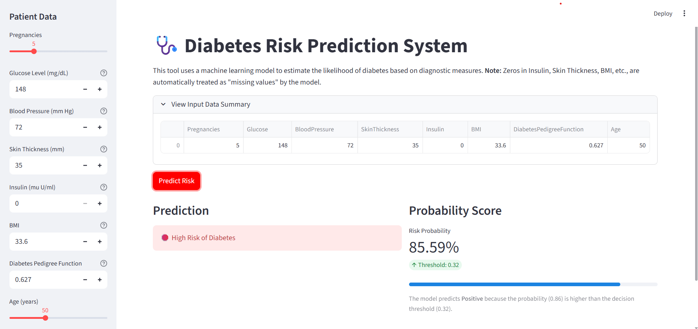

# 🩺 Diabetes Classification Using Machine Learning

---

## 📌 Project Overview
This project focuses on predicting whether a patient has diabetes based on diagnostic health measurements. A machine learning classification pipeline was built using proper preprocessing, model training, evaluation, and validation techniques.

A key feature of this implementation is the use of a **Custom Decision Threshold (0.32)** to prioritize **Recall**—ensuring that high-risk patients are identified even if their symptoms are subtle.

## 🎯 Objective
* **Reliable Classification**: Build a machine learning model to accurately classify diabetes outcomes.
* **Medical Data Handling**: Handle missing values (zeros) appropriately using median imputation.
* **Safety Optimization**: Optimize the trade-off between Precision and Recall for medical safety.
* **Deployment**: Deploy the model via an interactive **Streamlit** web interface.

## 📂 Dataset
* **Source**: Pima Indians Diabetes Dataset
* **Target Variable**: `Outcome` (1 = Diabetes, 0 = No Diabetes)
* **Key Features**: Pregnancies, Glucose, Blood Pressure, Skin Thickness, Insulin, BMI, Diabetes Pedigree Function, Age.

> ⚠️ **Note**: In this dataset, zero values in features like Insulin, BMI, and Glucose represent missing data and are handled during the preprocessing stage.

## ⚙️ Methodology

### 1️⃣ Data Preprocessing
* **Imputation**: Replaced invalid zeros with the median value of the respective column.
* **Scaling**: Applied `StandardScaler` to ensure all features contribute equally to the model.
* **Pipeline**: Utilized Scikit-learn `Pipeline` and `ColumnTransformer` to prevent data leakage.

### 2️⃣ Model Selection & Training
* **Final Model**: `Gradient Boosting Classifier`
* **Optimization**: Hyperparameters tuned via `RandomizedSearchCV`.
* **Threshold Tuning**: Shifted the decision boundary to **0.32** to maximize sensitivity (Recall).

## 📊 Performance Results
The following results compare the standard model against the optimized version used in the app:

| Metric | Default (0.50 Threshold) | **Custom (0.32 Threshold)** |
| :--- | :--- | :--- |
| **Accuracy** | ~76% | **~71%** |
| **Recall (Diabetes)** | ~56% | **~85%** |
| **Precision** | ~71% | **~55%** |
| **ROC–AUC** | 0.72 | **0.72** |


> **💡 Insight**: While Accuracy dropped slightly, **Recall increased significantly**. In healthcare, it is often better to have a "false alarm" (False Positive) than to miss a diabetic patient entirely (False Negative).

## 🖥️ Web Interface
The project includes a **Streamlit** application (`app.py`) for real-time predictions.
* **Input**: User-friendly sliders and number inputs for patient metrics.
* **Logic**: Uses a saved `.pkl` bundle containing the full preprocessing pipeline and threshold.
* **Output**: Visual risk probability and color-coded status alerts.



## 📁 Project Structure
```text
📦 Diabetes-Classification
 ┣ 📂 dataset
 ┃ ┗ 📄 diabetes.csv
 ┣ 📂 Plots
 ┃ ┣ 📄 correlation_matrix.png
 ┃ ┣ 📄 roc_curve.png
 ┃ ┗ 📄 cm_custom_threshold.png
 ┣ 📄 app.py                           # Streamlit Application
 ┣ 📄 diabetes_prediction_ml.py         # Model Training Script
 ┣ 📄 diabetes_model_with_threshold.pkl # Saved Model Bundle
 ┣ 📄 diabetes_prediction_ml.ipynb      # Development Notebook
 ┗ 📄 README.md
```

## 🛠️ Tech Stack
- Language: Python (Pandas, NumPy)
- ML Framework: Scikit-learn (ML Pipeline)

- Visualization: Matplotlib & Seaborn

- Web App: Streamlit

- Serialization: Joblib
